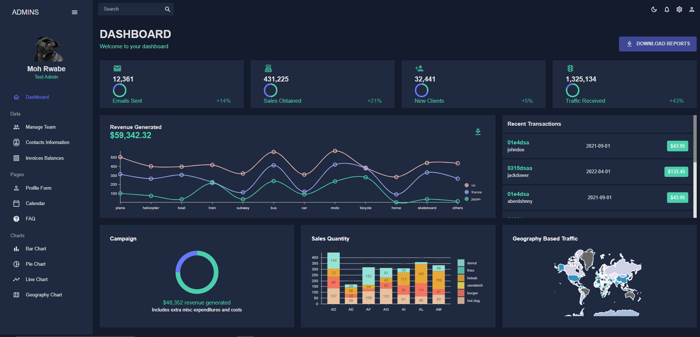

Dashboard Screenshot

### React Admin Dashboard ###
A beginner-friendly React project to explore UI components, routing, and state management.

 Features
 Responsive design using Flexbox
 React Router for navigation
 Interactive Nivo charts for data visualization
 State management with hooks
 Styled with CSS Flexbox for layout

 Tech Stack
React.js – Component-based UI
React Router – Client-side navigation
CSS Flexbox – Used for layout and responsiveness
Nivo – Beautiful and interactive data visualization

 ##Installation & Setup
Clone this repository:
sh
Copy
Edit
git clone https://github.com/MorwabEnock/react-admin-dashboard
Navigate to the project directory:
sh
Copy
Edit
cd repo-name
Install dependencies:
sh
Copy
Edit
npm install  # or yarn install
Start the development server:
sh
Copy
Edit
npm start  # or yarn start
Open http://localhost:3000 in your browser.

 Using Nivo for Charts
This project uses Nivo for data visualization. Example of how Nivo charts are used:

jsx
Copy
Edit
<!-- import { ResponsivePie } from '@nivo/pie';

const data = [
  { id: 'JavaScript', label: 'JavaScript', value: 55 },
  { id: 'Python', label: 'Python', value: 30 },
  { id: 'C++', label: 'C++', value: 15 },
];

const MyPieChart = () => (
  <ResponsivePie 
    data={data} 
    margin={{ top: 40, right: 80, bottom: 80, left: 80 }} 
    innerRadius={0.5} 
    padAngle={0.7} 
    colors={{ scheme: 'nivo' }}
  />
); 
export default MyPieChart;

-->

 Future Improvements
Add authentication (login/logout)
Improve UI with animations
Connect to a backend using Node.js
 License
This project is for learning purposes, feel free to use and modify.
